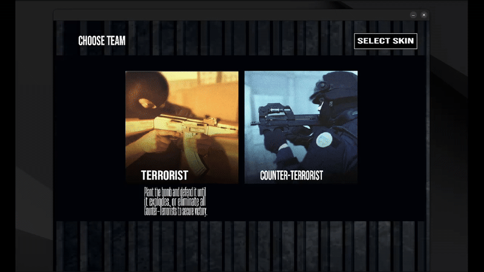
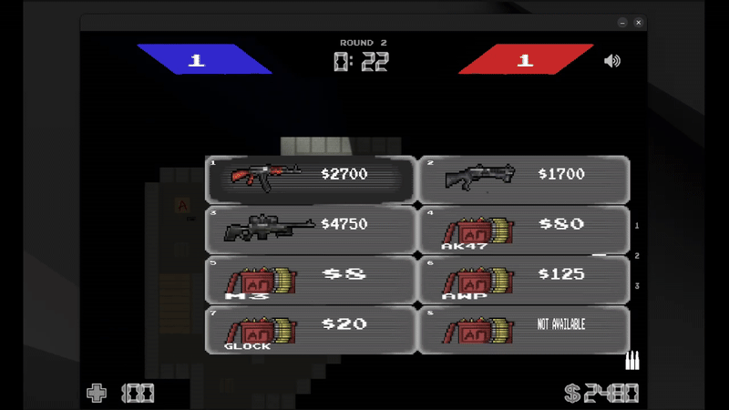
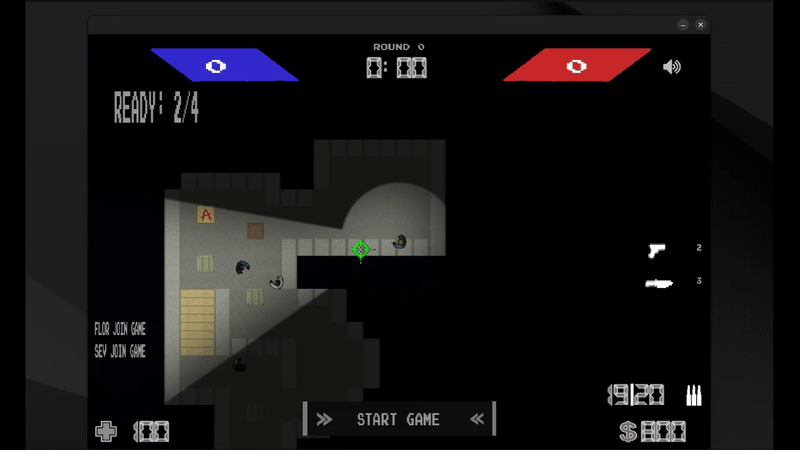
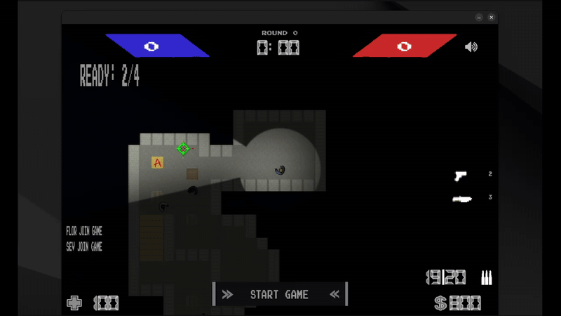
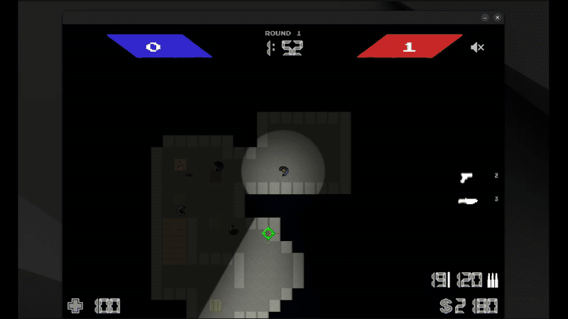
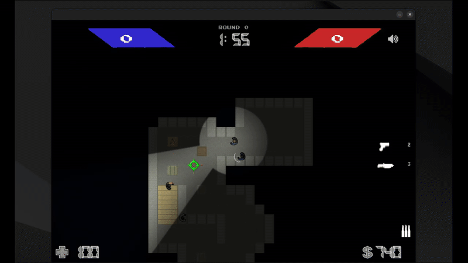
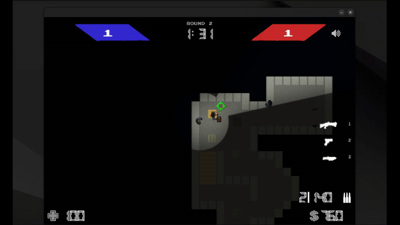

# 🕹️ Counter-Strike 2D - Remake

**Trabajo Final - 1C 2025**  
**Taller de Programación I – Cátedra Veiga**  
Facultad de Ingeniería, Universidad de Buenos Aires

---

## 👥 Integrantes

- **[FernandYu](https://github.com/FernandoYu)**
- **[Tcorzo](https://github.com/tcorzo)**
- **[fnpratto](https://github.com/fnpratto)**
- **[jesapugliese](https://github.com/jesapugliese)**

**Corrector**: Francisco Vázquez

---

## 📄 Descripción del Proyecto

Este proyecto es un remake en 2D del clásico juego **Counter-Strike**, desarrollado como trabajo final de la materia **Taller de Programación I**. Incluye:

- Cliente y servidor en C++20
- Comunicación en red mediante sockets
- Editor de niveles visual
- Lógica de juego en rondas, con roles, tienda, bombas, y puntajes
- Efectos visuales y sonoros (SDL)
- Configuración flexible vía archivos YAML

---

## 🎥 Vistazo al juego

> Muestra de las funcionalidades principales del juego en acción:

---

### 🧢 Selección de equipo y skin  
¡Elegí tu bando y personalizá tu personaje antes de cada partida!



---

### 💼 Compra de armas  
Abrí la tienda con `B`, seleccioná tu equipo y armate hasta los dientes.



---

### ⏱️ Esperando jugadores  
El juego comienza cuando todos están listos para la batalla.



---

### 📊 Scoreboard  
Al final de cada ronda, se muestra un resumen con estadísticas por jugador.



---

### ✅ Victoria de los Counter-Terrorists  
Los CTs logran defender el sitio y desactivar la bomba a tiempo.



---

### 💣 Victoria de los Terroristas  
Los terroristas consiguen plantar la bomba y hacerla estallar.



---

### 🔧 Desactivación de bomba  
Un anti-terrorista logra el defuse en el último segundo. ¡Épico!


-----


### Compilar

```bash
make
```

### Ejecutar servidor
```
./build/taller_server <puerto>
```

### Ejecutar cliente
```
./build/taller_client
```

---
📚 Documentación

Toda la documentación se encuentra en la carpeta `/docs`:

📘 Manual de Usuario: cómo compilar, ejecutar y jugar.

🧠 Documentación Técnica: estructura del código, módulos, funcionalidades y pendientes.

🛠️ Manual del Proyecto: organización del equipo, herramientas utilizadas, problemas y aprendizajes.
