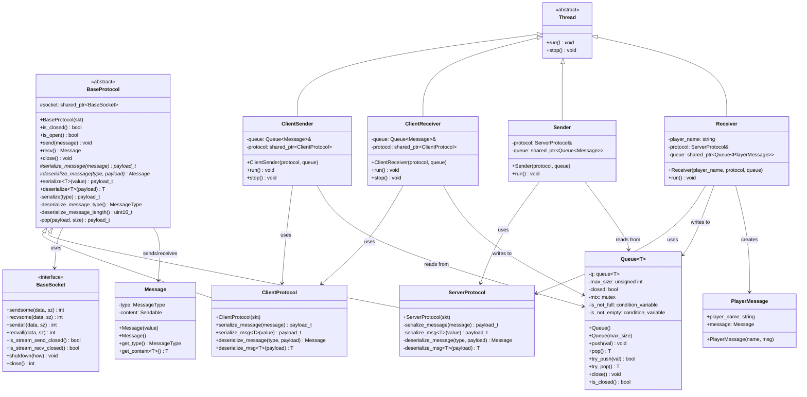

# Protocol Communication Class Diagram

This diagram shows the core protocol communication infrastructure, focusing on the protocol classes, communication threads, and supporting infrastructure. For detailed message types and command/response classes, see [message_classes.md](message_classes.md).

