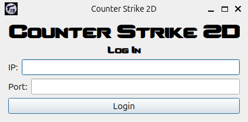
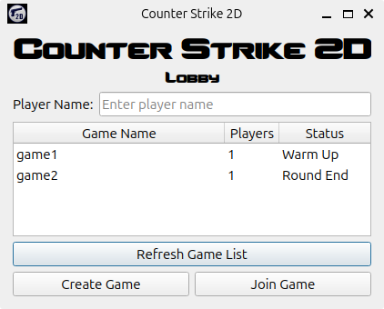
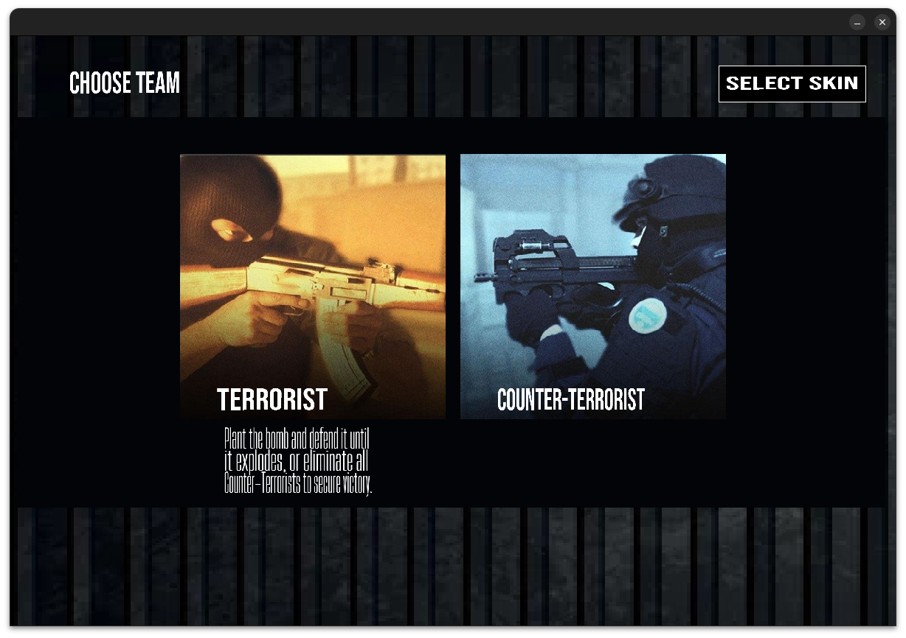
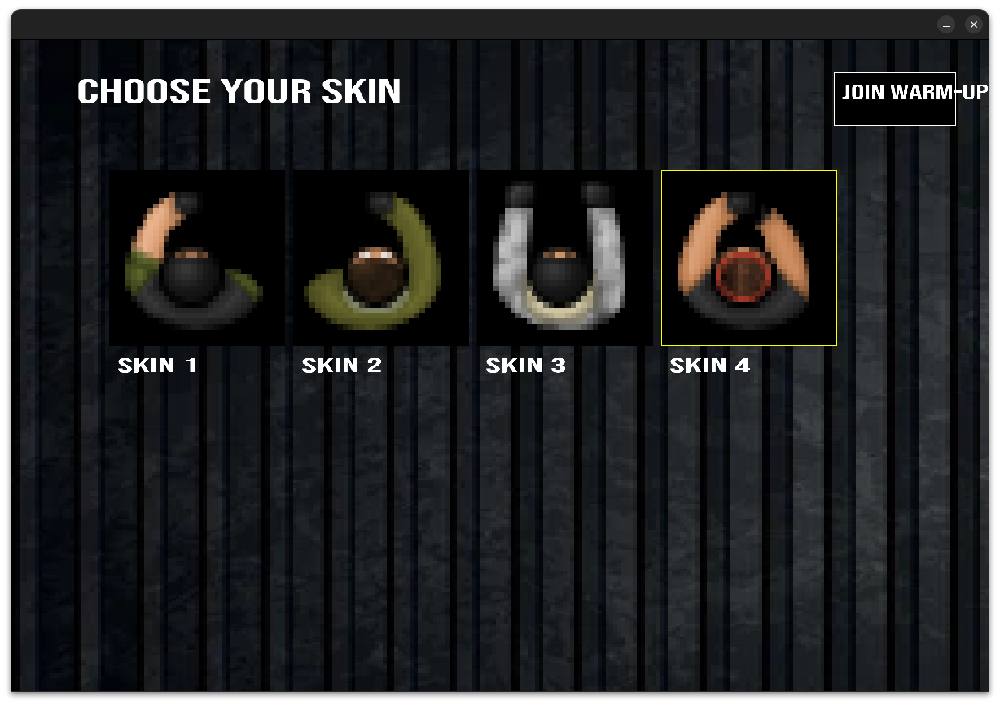
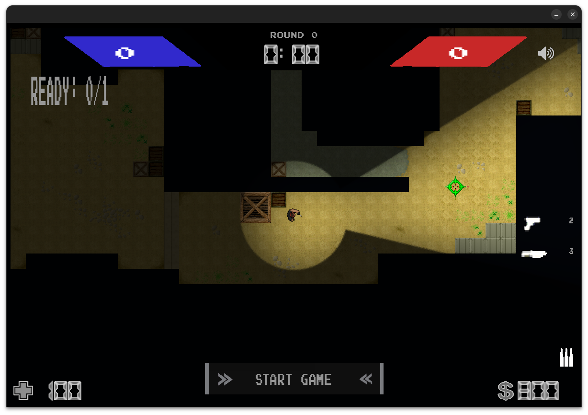

<!-- markdownlint-disable MD041 MD040 MD036 -->

# Manual de Usuario

Este manual describe cómo compilar, ejecutar y jugar el cliente del juego Counter-Strike 2D hecho por el grupo 8. Incluye las teclas de control y las funcionalidades disponibles.

## Tabla de contenidos

- [Ejecución](#ejecución)
- [Log in](#log-in)
- [Lobby](#lobby)
- [Juego](#juego)
  - [Pre-juego](#pre-juego)
  - [Partida](#partida)

## Ejecución

Para la ejecución del juego se lo deberá compilar ejecutando el siguiente comando:

```
make
```

Una vez compilado, es necesario iniciar un servidor:

```
./build/taller_server <port>
```

Y para iniciar un cliente:

```
./build/taller_client
```

## Log in

Una vez iniciado un cliente, se mostrará la siguiente ventana para loggearse con una dirección IP y un puerto:

<div style="display: flex; justify-content: center;">
  
</div>

## Lobby

Al loggearse a un servidor, se pasará al lobby:

<div style="display: flex; justify-content: center;">
  
</div>

Dentro del lobby, una vez colocada el nombre del jugador (_player name_), se podrá:

- `Create Game`: crear una partida nueva.

  Se deberá cargar el nombre de la partida y elegir un mapa donde jugarla (se proporcionará una lista con los nombres de los mapas disponibles).

- `Join Game`: unirse a una partida ya existente. Solo permitirá unirse a partidas en estado de `Warm Up`, ya que el resto ya comenzaron.
- `Refresh Game List`: refrescar la lista de partidas.

## Juego

Al ingresar a una partida, se pedirá elegir un equipo y una skin.

El juego se puede silenciar (mute) apretando la tecla `M`.

### Pre-juego

**Equipos:**

- Terrorista: siendo un terrorista, deberás plantar la bomba y defenderla hasta que explote para ganar, o bien matar a todos los anti-terroristas.

- Anti-terrorista: siendo un anti-terrorista, deberás prevenir que la bomba explote desactivándola si está plantada, o eliminando a todos los terroristas.

<div style="display: flex; justify-content: center;">
  
</div>

Una vez elegido el equipo, se podrá seleccionar una **skin** de acuerdo a este y, finalmente, comenzar el calentamiento haciendo click en el botón superior derecho:

<div style="display: flex; justify-content: center;">
  
</div>

El jugador aparecerá en el mapa al iniciar la partida. Se mostrará un botón para comenzar la partida. La partida comenzará cuando todos los jugadores estén listos.

<div style="display: flex; justify-content: center;">
  
</div>

### Partida

Al comenzar la partida, los jugadores aparecerán en sus spawns.

La partida consta de una serie de rondas, cada una con una cantidad de tiempo prefijado.

#### Fase de compra

En esta primera fase de la ronda, se le permite al usuario comprar armas y munición.

El usuario puede ingresar a la tienda presionando la tecla `B`. Se puede comprar equipamientos apretando el botón izquierdo del ratón.

Al presionar `Esc` se sale de la tienda.

<!-- Insertar foto de la shop -->

#### Fase de juego

Uno de los jugadores del equipo terrorista tendrá la bomba y deberá ser quien la plante en uno de los monumentos marcados en el mapa.

<!-- Insertar foto de los tiles de los bomb sites -->

**Controles de movimiento:**

- `W` (↑): Mover al jugador hacia arriba
- `S` (↓): Mover al jugador hacia abajo
- `A` (←): Mover al jugador hacia la izquierda
- `D` (→): Mover al jugador hacia la derecha

**Controles de acción:**

- Movimiento del Ratón: Mover el puntero una vez en el mapa mueve la mira del jugador (_aim_)
- Números del 1 al 4: Cambiar el arma sostenida en las manos (solo si se tiene esa arma equipada)
- Botón Izquierdo (Left Click): Disparar
- `R`: Recargar arma en mano
- `E`: Plantar la bomba siendo terrorista, sino defusear la bomba
