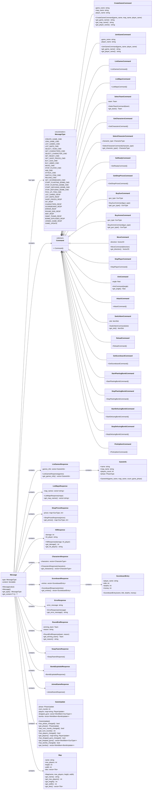

# Message System Class Diagram

```mermaid
classDiagram
    direction LR

    %% Core Message System
    class Message {
        -type: MessageType
        -content: Sendable
        +Message(value)
        +Message()
        +get_type() MessageType
        +get_content~T~() T
    }

    class MessageType {
        <<enumeration>>
        CREATE_GAME_CMD
        JOIN_GAME_CMD
        LIST_GAMES_CMD
        LIST_MAPS_CMD
        SELECT_TEAM_CMD
        GET_CHARACTERS_CMD
        SELECT_CHARACTER_CMD
        SET_READY_CMD
        GET_SHOP_PRICES_CMD
        BUY_GUN_CMD
        BUY_AMMO_CMD
        MOVE_CMD
        STOP_PLAYER_CMD
        AIM_CMD
        ATTACK_CMD
        SWITCH_ITEM_CMD
        RELOAD_CMD
        GET_SCOREBOARD_CMD
        START_PLANTING_BOMB_CMD
        STOP_PLANTING_BOMB_CMD
        START_DEFUSING_BOMB_CMD
        STOP_DEFUSING_BOMB_CMD
        PICK_UP_ITEM_CMD
        LIST_GAMES_RESP
        LIST_MAPS_RESP
        SHOP_PRICES_RESP
        HIT_RESP
        CHARACTERS_RESP
        SCOREBOARD_RESP
        ERROR_RESP
        ROUND_END_RESP
        MAP_RESP
        SWAP_TEAMS_RESP
        BOMB_EXPLODED_RESP
        JOINED_GAME_RESP
        GAME_UPDATE
        ...
    }

    %% Abstract Base Classes
    class Command {
        <<abstract>>
        +~Command()
    }

    %% Lobby Commands
    class CreateGameCommand {
        -game_name: string
        -map_name: string
        -player_name: string
        +CreateGameCommand(game_name, map_name, player_name)
        +get_game_name() string
        +get_map_name() string
        +get_player_name() string
    }

    class JoinGameCommand {
        -game_name: string
        -player_name: string
        +JoinGameCommand(game_name, player_name)
        +get_game_name() string
        +get_player_name() string
    }

    class ListGamesCommand {
        +ListGamesCommand()
    }

    class ListMapsCommand {
        +ListMapsCommand()
    }

    class SelectTeamCommand {
        -team: Team
        +SelectTeamCommand(team)
        +get_team() Team
    }

    class GetCharactersCommand {
        +GetCharactersCommand()
    }

    class SelectCharacterCommand {
        -character_type: CharacterType
        +SelectCharacterCommand(character_type)
        +get_character_type() CharacterType
    }

    class SetReadyCommand {
        +SetReadyCommand()
    }

    %% Shop Commands
    class GetShopPricesCommand {
        +GetShopPricesCommand()
    }

    class BuyGunCommand {
        -gun_type: GunType
        +BuyGunCommand(gun_type)
        +get_gun_type() GunType
    }

    class BuyAmmoCommand {
        -gun_type: GunType
        +BuyAmmoCommand(gun_type)
        +get_gun_type() GunType
    }

    %% Game Commands
    class MoveCommand {
        -direction: Vector2D
        +MoveCommand(direction)
        +get_direction() Vector2D
    }

    class StopPlayerCommand {
        +StopPlayerCommand()
    }

    class AimCommand {
        -angle: float
        +AimCommand(angle)
        +get_angle() float
    }

    class AttackCommand {
        +AttackCommand()
    }

    class SwitchItemCommand {
        -slot: ItemSlot
        +SwitchItemCommand(slot)
        +get_slot() ItemSlot
    }

    class ReloadCommand {
        +ReloadCommand()
    }

    class GetScoreboardCommand {
        +GetScoreboardCommand()
    }

    class StartPlantingBombCommand {
        +StartPlantingBombCommand()
    }

    class StopPlantingBombCommand {
        +StopPlantingBombCommand()
    }

    class StartDefusingBombCommand {
        +StartDefusingBombCommand()
    }

    class StopDefusingBombCommand {
        +StopDefusingBombCommand()
    }

    class PickUpItemCommand {
        +PickUpItemCommand()
    }

    %% Server Responses
    class ListGamesResponse {
        -games_info: vector~GameInfo~
        +ListGamesResponse(games)
        +get_games_info() vector~GameInfo~
    }

    class ListMapsResponse {
        -map_names: vector~string~
        +ListMapsResponse(maps)
        +get_map_names() vector~string~
    }

    class ShopPricesResponse {
        -prices: map~GunType, int~
        +ShopPricesResponse(prices)
        +get_prices() map~GunType, int~
    }

    class HitResponse {
        -damage: int
        -hit_player: string
        +HitResponse(damage, hit_player)
        +get_damage() int
        +get_hit_player() string
    }

    class CharactersResponse {
        -characters: vector~CharacterType~
        +CharactersResponse(characters)
        +get_characters() vector~CharacterType~
    }

    class ScoreboardResponse {
        -entries: vector~ScoreboardEntry~
        +ScoreboardResponse(entries)
        +get_entries() vector~ScoreboardEntry~
    }

    class ErrorResponse {
        -error_message: string
        +ErrorResponse(message)
        +get_error_message() string
    }

    class RoundEndResponse {
        -winning_team: Team
        -reason: string
        +RoundEndResponse(team, reason)
        +get_winning_team() Team
        +get_reason() string
    }

    class SwapTeamsResponse {
        +SwapTeamsResponse()
    }

    class BombExplodedResponse {
        +BombExplodedResponse()
    }

    class JoinedGameResponse {
        +JoinedGameResponse()
    }

    %% Game Updates
    class GameUpdate {
        -phase: PhaseUpdate
        -num_rounds: int
        -players: map~string, PlayerUpdate~
        -dropped_guns: vector~WorldItem~GunType~~
        -bombs: vector~WorldItem~BombUpdate~~
        +GameUpdate()
        +has_phase_changed() bool
        +get_phase() PhaseUpdate
        +has_num_rounds_changed() bool
        +get_num_rounds() int
        +has_players_changed() bool
        +get_players() map~string, PlayerUpdate~
        +has_dropped_guns_changed() bool
        +get_dropped_guns() vector~WorldItem~GunType~~
        +has_bombs_changed() bool
        +get_bombs() vector~WorldItem~BombUpdate~~
    }

    %% Data Structures
    class GameInfo {
        +name: string
        +map_name: string
        +players_count: int
        +phase: PhaseType
        +GameInfo(game_name, map_name, count, game_phase)
    }

    class ScoreboardEntry {
        +player_name: string
        +kills: int
        +deaths: int
        +money: int
        +ScoreboardEntry(name, kills, deaths, money)
    }

    class Map {
        -name: string
        -max_players: int
        -height: int
        -width: int
        -tiles: vector~Tile~
        +Map(name, max_players, height, width)
        +get_name() string
        +get_max_players() int
        +get_height() int
        +get_width() int
        +get_tiles() vector~Tile~
    }

    %% Relationships
    Message --> MessageType : has type

    %% Command inheritance
    Command <|-- CreateGameCommand
    Command <|-- JoinGameCommand
    Command <|-- ListGamesCommand
    Command <|-- ListMapsCommand
    Command <|-- SelectTeamCommand
    Command <|-- GetCharactersCommand
    Command <|-- SelectCharacterCommand
    Command <|-- SetReadyCommand
    Command <|-- GetShopPricesCommand
    Command <|-- BuyGunCommand
    Command <|-- BuyAmmoCommand
    Command <|-- MoveCommand
    Command <|-- StopPlayerCommand
    Command <|-- AimCommand
    Command <|-- AttackCommand
    Command <|-- SwitchItemCommand
    Command <|-- ReloadCommand
    Command <|-- GetScoreboardCommand
    Command <|-- StartPlantingBombCommand
    Command <|-- StopPlantingBombCommand
    Command <|-- StartDefusingBombCommand
    Command <|-- StopDefusingBombCommand
    Command <|-- PickUpItemCommand

    %% Message contains different types
    Message --> Command : contains
    Message --> ListGamesResponse : contains
    Message --> ListMapsResponse : contains
    Message --> ShopPricesResponse : contains
    Message --> HitResponse : contains
    Message --> CharactersResponse : contains
    Message --> ScoreboardResponse : contains
    Message --> ErrorResponse : contains
    Message --> RoundEndResponse : contains
    Message --> SwapTeamsResponse : contains
    Message --> BombExplodedResponse : contains
    Message --> JoinedGameResponse : contains
    Message --> GameUpdate : contains
    Message --> Map : contains

    %% Response dependencies
    ListGamesResponse --> GameInfo : contains
    ScoreboardResponse --> ScoreboardEntry : contains
```
