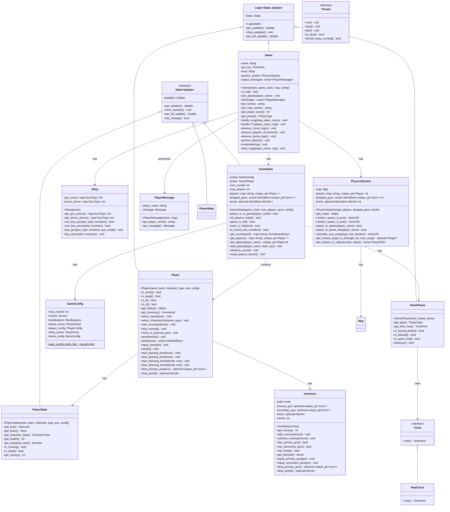

# Server Game Logic Class Diagram

This diagram shows the core game logic components, including the game engine, player management, physics system, and game state management.

```mermaid
classDiagram
    %% Game Engine
    class Game {
        -name: string
        -last_tick: TimePoint
        -shop: Shop
        -physics_system: PhysicsSystem
        -output_messages: vector~PlayerMessage~
        +Game(name, game_clock, map, config)
        +is_full() bool
        +join_player(player_name) void
        +tick(msgs) vector~PlayerMessage~
        +get_name() string
        +get_map_name() string
        +get_player_count() int
        +get_phase() PhaseType
        -handle_msg(msg, player_name) void
        -handle~T~(player_name, msg) void
        -advance_round_logic() void
        -advance_players_movement() void
        -advance_bomb_logic() void
        -perform_attacks() void
        -broadcast(msg) void
        -send_msg(player_name, msg) void
    }

    %% Game State Management
    class GameState {
        -config: GameConfig
        -phase: GamePhase
        -num_rounds: int
        -max_players: int
        -players: map~string, unique_ptr~Player~~
        -dropped_guns: vector~WorldItem~unique_ptr~Gun~~~
        -bomb: optional~WorldItem~Bomb~~
        +GameState(game_clock, max_players, guns, config)
        +player_is_in_game(player_name) bool
        +all_players_ready() bool
        +game_is_full() bool
        +team_is_full(team) bool
        +is_round_end_condition() bool
        +get_scoreboard() map~string, ScoreboardEntry~
        +get_players() map~string, unique_ptr~Player~~
        +get_player(player_name) unique_ptr~Player~&
        +add_player(player_name, team, pos) void
        +advance_round() void
        +swap_players_teams() void
    }

    class GamePhase {
        +GamePhase(clock, phase_times)
        +get_type() PhaseType
        +get_time_now() TimePoint
        +is_buying_phase() bool
        +is_playing() bool
        +is_game_end() bool
        +advance() bool
    }

    class GameConfig {
        +max_rounds: int
        +scores: Scores
        +bonifications: Bonifications
        +phase_times: PhaseTimes
        +player_config: PlayerConfig
        +shop_prices: ShopPrices
        +items_config: ItemsConfig
        +load_config(config_file)$ GameConfig
    }

    %% Player Management
    class Player {
        +Player(name, team, character_type, pos, config)
        +is_ready() bool
        +is_dead() bool
        +is_tt() bool
        +is_ct() bool
        +get_hitbox() Hitbox
        +get_inventory() Inventory&
        +select_team(team) void
        +select_character(character_type) void
        +start_moving(velocity) void
        +stop_moving() void
        +move_to_pos(new_pos) void
        +aim(direction) void
        +attack(now) vector~AttackEffect~
        +equip_item(slot) void
        +reload() void
        +start_planting_bomb(now) void
        +stop_planting_bomb(now) void
        +start_defusing_bomb(bomb, now) void
        +stop_defusing_bomb(bomb, now) void
        +drop_primary_weapon() optional~unique_ptr~Gun~~
        +drop_bomb() optional~Bomb~
    }

    class PlayerState {
        +PlayerState(name, team, character_type, pos, config)
        +get_pos() Vector2D
        +get_team() Team
        +get_character_type() CharacterType
        +get_health() int
        +get_equipped_item() ItemSlot
        +is_moving() bool
        +is_dead() bool
        +get_money() int
    }

    class Inventory {
        -knife: Knife
        -primary_gun: optional~unique_ptr~Gun~~
        -secondary_gun: optional~unique_ptr~Gun~~
        -bomb: optional~Bomb~
        -money: int
        +Inventory(money)
        +get_money() int
        +add_money(amount) void
        +subtract_money(amount) void
        +has_primary_gun() bool
        +has_secondary_gun() bool
        +has_bomb() bool
        +get_item(slot) Item&
        +equip_primary_gun(gun) void
        +equip_secondary_gun(gun) void
        +drop_primary_gun() optional~unique_ptr~Gun~~
        +drop_bomb() optional~Bomb~
    }

    %% Game Systems
    class Shop {
        -gun_prices: map~GunType, int~
        -ammo_prices: map~GunType, int~
        +Shop(prices)
        +get_gun_prices() map~GunType, int~
        +get_ammo_prices() map~GunType, int~
        +can_buy_gun(gun_type, inventory) bool
        +can_buy_ammo(slot, inventory) bool
        +buy_gun(gun_type, inventory, gun_config) void
        +buy_ammo(slot, inventory) void
    }

    class PhysicsSystem {
        -map: Map
        -players: map~string, unique_ptr~Player~~&
        -dropped_guns: vector~WorldItem~unique_ptr~Gun~~~&
        -bomb: optional~WorldItem~Bomb~~&
        +PhysicsSystem(map, players, dropped_guns, bomb)
        +get_map() Map&
        +random_spawn_tt_pos() Vector2D
        +random_spawn_ct_pos() Vector2D
        +player_in_spawn(player_name) bool
        +player_in_bomb_site(player_name) bool
        +calculate_new_pos(player, tick_duration) Vector2D
        +get_closest_target_in_dir(origin, dir, max_range) optional~Target~
        +get_players_in_radius(center, radius) vector~PlayerRef~
    }

    %% Abstract Base Classes
    class Logic~State, Update~ {
        #state: State
        +Logic(state)
        +get_updates() Update
        +clear_updates() void
        +get_full_update() Update
    }

    class State~Update~ {
        <<abstract>>
        #updates: Update
        +get_updates() Update
        +clear_updates() void
        +get_full_update() Update
        +has_change() bool
    }

    class Thread {
        <<abstract>>
        +run()* void
        +stop() void
        +join() void
        +is_alive() bool
        +should_keep_running() bool
    }

    %% Supporting Classes
    class PlayerMessage {
        -player_name: string
        -message: Message
        +PlayerMessage(name, msg)
        +get_player_name() string
        +get_message() Message
    }

    %% Clock System
    class Clock {
        <<interface>>
        +now()* TimePoint
    }

    class RealClock {
        +now() TimePoint
    }

    %% Relationships - Inheritance
    Logic~GameState, GameUpdate~ <|-- Game
    Logic~PlayerState, PlayerUpdate~ <|-- Player
    Logic~PhaseState, PhaseUpdate~ <|-- GamePhase
    State~GameUpdate~ <|-- GameState
    State~PlayerUpdate~ <|-- PlayerState
    State~PhaseUpdate~ <|-- PhaseState
    Clock <|-- RealClock

    %% Relationships - Composition
    Game --> GameState : has
    Game --> Shop : has
    Game --> PhysicsSystem : has
    GameState --> GamePhase : has
    GameState --> Player : contains
    GameState --> GameConfig : has
    Player --> PlayerState : has
    Player --> Inventory : has
    PhysicsSystem --> Map : has

    %% Relationships - Usage
    Game --> PlayerMessage : processes
    GamePhase --> Clock : uses
```
